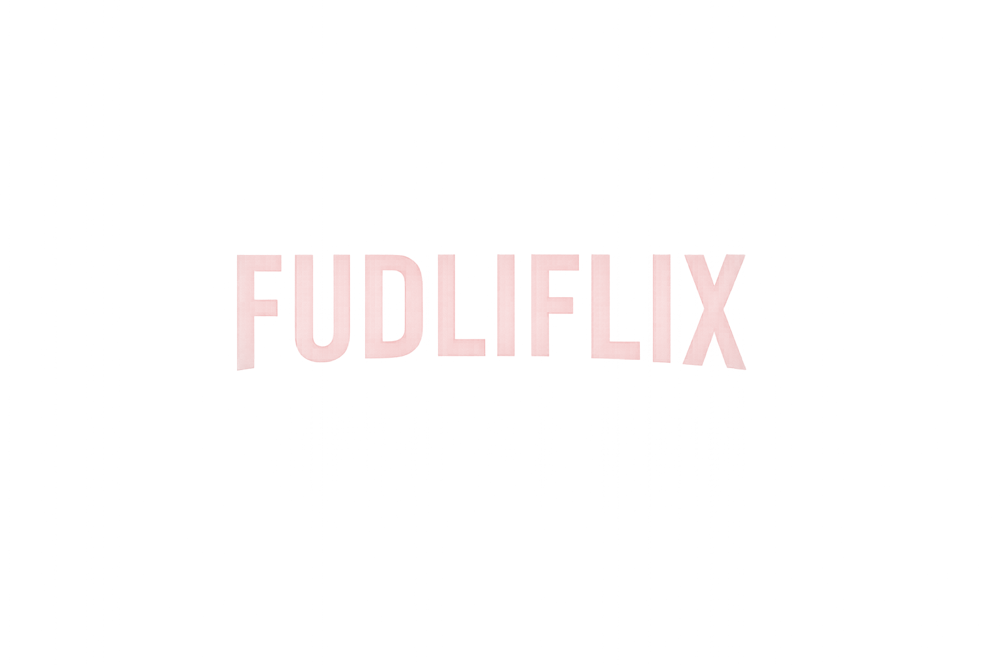

<div align="center">
  
  <h1>Fudliflix</h1>
  <p><strong>A sleek, modern theme for Jellyfin</strong></p>
  <p>Cinematic UI with smooth animations and a premium feel.</p>
</div>

---

## Usage

Go to **Settings > Dashboard > General**, scroll down to **Custom CSS** and paste the import line.

### Base Theme

```css
@import url("https://cdn.jsdelivr.net/gh/arturict/Fudliflix@main/default.css");
```

### With Logos (recommended)

```css
@import url("https://cdn.jsdelivr.net/gh/arturict/Fudliflix@main/default.css");
@import url("https://cdn.jsdelivr.net/gh/arturict/Fudliflix@main/addons/Logo.css");
```

### Pinned Version

Replace `main` with a specific commit hash or tag to lock the version:

```css
@import url("https://cdn.jsdelivr.net/gh/arturict/Fudliflix@<commit-or-tag>/default.css");
@import url("https://cdn.jsdelivr.net/gh/arturict/Fudliflix@<commit-or-tag>/addons/Logo.css");
```

---

## Color Variants

The default accent is red. You can override it with these addons:

**Jellyfin Blue:**
```css
@import url("https://cdn.jsdelivr.net/gh/arturict/Fudliflix@main/addons/jf-blue.css");
```

**Jellyfin Purple:**
```css
@import url("https://cdn.jsdelivr.net/gh/arturict/Fudliflix@main/addons/jf-purple.css");
```

---

## Screenshots

<div align="center">
  <h3>Login</h3>
  
  <h3>Home</h3>
  
  <h3>Library</h3>
  
  
  <h3>Movie Detail</h3>
  
  <h3>TV Show Detail</h3>
  
</div>

---

## Tips

- Use **67% zoom** on desktop for the best experience.
- If you find any issues with your device, open an issue with your device name and type (Mobile/TV/Desktop).

---

Based on [JellyFlix](https://github.com/prayag17/JellyFlix) by prayag17.
